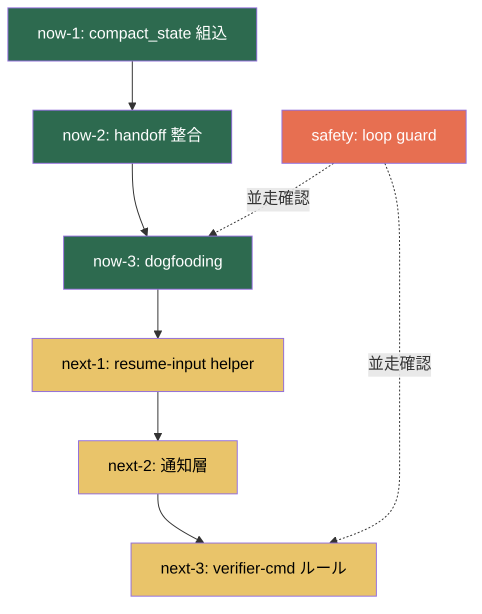

# デバッグ戦略 & 依存関係リファレンス

_Created: 2026-04-03_

> **補助リファレンス** — 親文書は [`MASTER_FLOW.md`](MASTER_FLOW.md)。
> この文書は subplan 横断のデバッグ知見と依存関係の理由を保持する。

---

## 1. Phase 間の依存関係

### なぜこの依存順か

| From → To | 理由 |
|-----------|------|
| now-1 → now-2 | compact_state 出力が handoff テンプレートの入力情報を規定する |
| now-2 → now-3 | handoff 整合が取れていないと dogfooding の verifier 検証が不安定 |
| now-3 → next-1 | dogfooding で判明した実際の resume パターンが next-1 の要件になる |
| safety ⇢ now-3 | dogfooding 中に loop guard を実環境で確認するのが最も効率的 |

### 独立着手可能な Phase

- **now-1** — 依存先なし
- **safety** — いつでも着手可能（now-3 と並走推奨だが独立も可）

---

## 2. デバッグ戦略（全 subplan 共通）

### 挿入優先度

1. 🔴 **helper 間 JSON 受け渡し** — ファイル存在・キー欠損・型不一致
2. 🟠 **strict/fail-open 分岐** — 意図しない停止/続行
3. 🟡 **verifier-cmd 入出力** — 外部コマンドの不確実性
4. 🟢 **各 helper 正常系出力** — フォーマットずれ

### 原則

- `stderr` に出す（`stdout` は JSON 出力予約）
- `[DEBUG][helper名]` プレフィックスで grep 可能に
- `--debug` フラグで on/off 制御
- fail-open: デバッグコードがエラーでも本体を止めない

---

## 3. ステータス追跡

| Phase | Status | 着手日 | 完了日 | 備考 |
|-------|--------|-------|-------|------|
| now-1 | `not_started` | | | |
| now-2 | `not_started` | | | |
| now-3 | `not_started` | | | |
| safety | `not_started` | | | |
| next-1 | `not_started` | | | |
| next-2 | `not_started` | | | |
| next-3 | `not_started` | | | |
