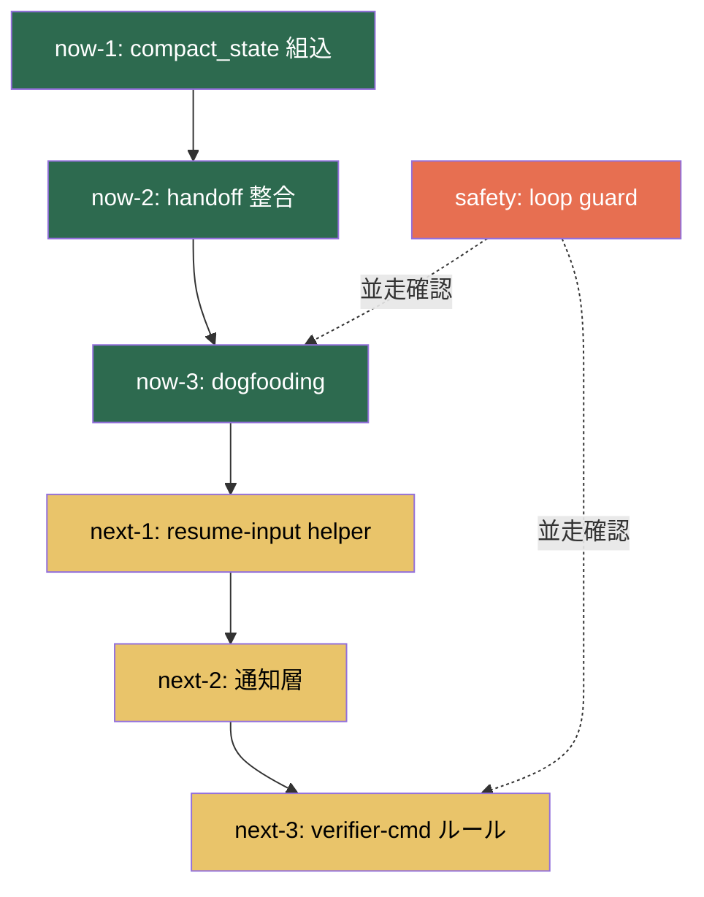

# Master Flow — ToDo タスク進行ガイド

> **Advisory Notice**
> このプランは強制ではありません。推奨順序・手法を示すガイドです。
> スキップ・入替・部分採用すべて監督判断で自由に変更可。

_Created: 2026-04-03_

---

## 全体構造

```
Now (最優先)
├── now-1: compact_state → 実運用組み込み
├── now-2: handoff → verifier-contract 整合
└── now-3: orchestrator → 実タスク dogfooding

Safety (Now と並走)
└── safety: loop guard 再確認

Next (Now 完了後)
├── next-1: resume-input 変換 helper
├── next-2: 通知層 (guard → notification)
└── next-3: verifier-cmd 運用ルール固定
```

---

## 依存関係



### 依存ルール

| From → To | なぜ依存するか |
|-----------|---------------|
| now-1 → now-2 | compact_state 出力が handoff テンプレートの入力情報を規定する |
| now-2 → now-3 | handoff 整合が取れていないと dogfooding の verifier 検証が不安定 |
| now-3 → next-1 | dogfooding で判明した実際の resume パターンが next-1 の要件になる |
| safety ⇢ now-3 | dogfooding 中に loop guard を実環境で確認するのが最も効率的 |

### 独立実行可能

- **now-1** は単独で着手可能（依存先なし）
- **safety** はいつでも着手可能（now-3 と並走推奨だが独立も可）

---

## Subplan 索引

各 subplan は `.planning/<phase-id>/subplan.md` に格納。

| Phase ID | Subplan | 主対象ファイル | 推定ワークロード |
|----------|---------|---------------|----------------|
| `now-1_compact-state-integration` | [subplan](now-1_compact-state-integration/subplan.md) | `poc/compact_state_helper.py` | 1-2 セッション |
| `now-2_handoff-verifier-alignment` | [subplan](now-2_handoff-verifier-alignment/subplan.md) | `poc/handoff_helper.py` | 1 セッション |
| `now-3_orchestrator-dogfooding` | [subplan](now-3_orchestrator-dogfooding/subplan.md) | `poc/one_shot_orchestrator.py` | 2-3 セッション |
| `safety_loop-guard-reconfirm` | [subplan](safety_loop-guard-reconfirm/subplan.md) | `poc/loop_guard.py` | now-3 と並走 |
| `next-1_resume-input-helper` | [subplan](next-1_resume-input-helper/subplan.md) | 新規 or 既存拡張 | 1 セッション |
| `next-2_notification-layer` | [subplan](next-2_notification-layer/subplan.md) | 新規 | 1 セッション |
| `next-3_verifier-cmd-rules` | [subplan](next-3_verifier-cmd-rules/subplan.md) | `verifier-contract.md` | 1-2 セッション |

---

## デバッグ戦略（全 subplan 共通）

### 挿入優先度

1. 🔴 **helper 間 JSON 受け渡し** — ファイル存在・キー欠損・型不一致
2. 🟠 **strict/fail-open 分岐** — 意図しない停止/続行
3. 🟡 **verifier-cmd 入出力** — 外部コマンドの不確実性
4. 🟢 **各 helper 正常系出力** — フォーマットずれ

### 原則

- `stderr` に出す（`stdout` は JSON 出力予約）
- `[DEBUG][helper名]` プレフィックスで grep 可能に
- `--debug` フラグで on/off 制御
- fail-open: デバッグコードがエラーでも本体を止めない

---

## ステータス追跡

| Phase | Status | 着手日 | 完了日 | 備考 |
|-------|--------|-------|-------|------|
| now-1 | `not_started` | | | |
| now-2 | `not_started` | | | |
| now-3 | `not_started` | | | |
| safety | `not_started` | | | |
| next-1 | `not_started` | | | |
| next-2 | `not_started` | | | |
| next-3 | `not_started` | | | |

---

## Later / Not Now（参考）

今回の subplan 対象外。ToDo.md の Later / Not Now セクションを参照。

- true `/compact` layer
- state/evidence context reduction
- full automation loop guard 拡張
- Team Runtime 本実装
- Codex 本体 fork / full auto loop / trigger・worktree 本実装 / memory 本格実装
